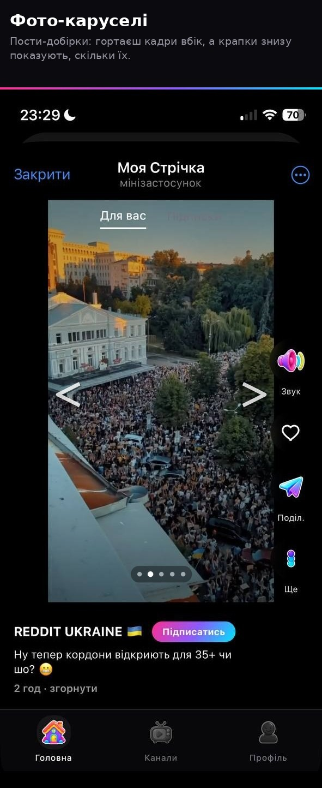
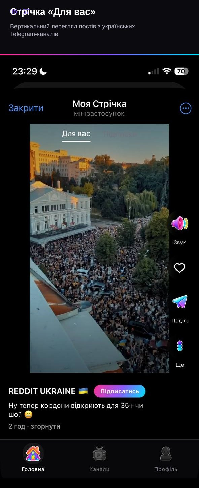
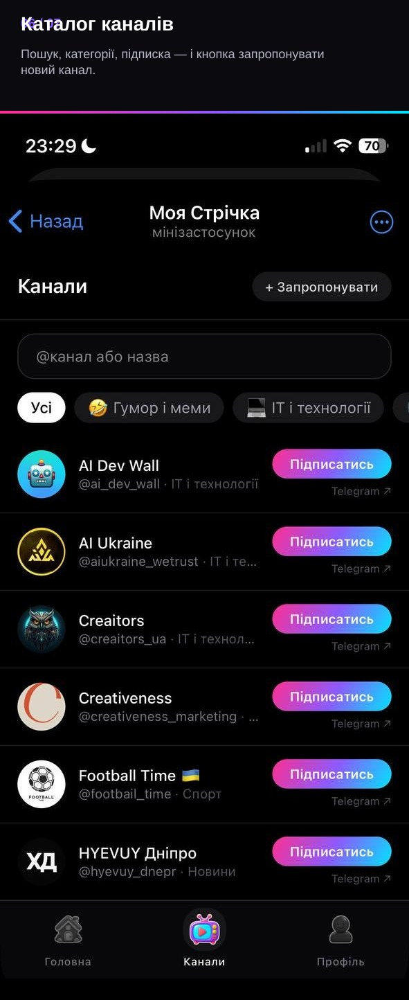
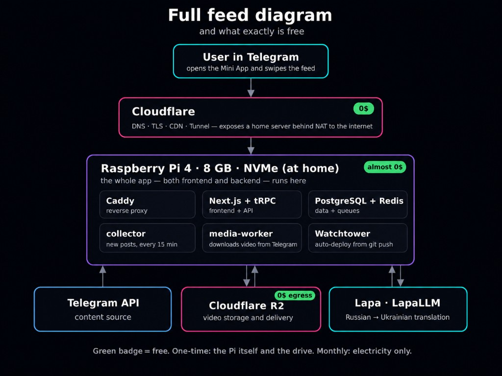

# tiktok-gram

A vertical, swipe-through feed — built like TikTok — for the Telegram channels
you actually read. You pick the channels; a userbot collects their posts; a
transparent, inspectable scoring formula (not an opaque ML model) ranks them
into one continuous feed, rendered as a Telegram Mini App. No ads, no
algorithm you can't read the source of, and it runs for $0 on hardware as
small as a Raspberry Pi. 📱

## Screenshots

From the live app (Ukrainian UI), as shown in the
[DOU write-up](https://dou.ua/forums/topic/60825/):

| Photo carousel in the vertical feed | Video post in «For you» | Channel catalog & subscriptions |
| --- | --- | --- |
|  |  |  |

The open-source UI defaults to English (`LOCALE=en`); see [i18n](#i18n).

## Architecture overview

Full stack — and what's free:



Green badge = free. One-time: the Pi and the drive. Monthly: electricity only.

## Why it costs $0

- **Storage & bandwidth**: video lives in a Cloudflare R2 bucket. R2's free
  tier (per Cloudflare's published pricing as of writing — verify current
  limits before relying on them) gives you 10 GB-month of Standard storage,
  1 million Class A operations, 10 million Class B operations, and **zero
  egress fees** — so a browser streaming video directly out of R2 never costs
  you a cent in bandwidth. A [per-channel fair-eviction cache](docs/media-cache.md)
  keeps total cached video under a configurable budget (9.8 GB by default) so
  you stay inside the free tier as channels keep publishing.
- **Compute**: everything else (Postgres, Redis, the Next.js app, the
  collector, the media worker) is small enough to run on a Raspberry Pi or
  any $5/mo VPS. Photos and audio are tiny enough to store as bytes directly
  in Postgres instead of paying for object storage on them at all.
- **Ingress**: point a Cloudflare Tunnel (or any reverse-proxy tunnel you
  already use) at the bundled Caddy container, or give Caddy a real domain
  and it will get you a TLS cert via ACME. Neither costs anything.

See [`docs/setup/cloudflare-r2.md`](docs/setup/cloudflare-r2.md) and
[`docs/setup/deploy.md`](docs/setup/deploy.md) for the concrete setup.

## Architecture

```
Telegram channels
      │  (userbot joins + polls)
      ▼
Telethon collector (scripts/collector-sync.py) ──▶ Postgres (posts, media rows, sessions)
      │                                                   ▲
      │ enqueues media jobs via Redis                     │
      ▼                                                    │
media-worker (ffmpeg transcode → H.264, R2 upload) ────────┘
      │                                                    │
      ▼                                                    │
Cloudflare R2 (video only; photos/audio live in Postgres)  │
      │  presigned URLs, browser fetches directly           │
      ▼                                                    │
Next.js app (tRPC, Drizzle) ───────────────────────────────┘
      │  rendered inside
      ▼
Telegram Mini App (the actual UI users scroll)

Optional: photo-only posts ──▶ music-enrichment service ──▶ background track
```

- A **Telethon userbot** (a real Telegram account, not a Bot API bot) joins
  the channels you add and polls them for new posts.
- **Postgres** is the single source of truth: post metadata, media rows, the
  userbot's own login session, likes/saves/views, subscriptions. **Redis**
  backs the media-cache job queue and the music-enrichment job queue.
- The **media-worker** downloads new media from Telegram, transcodes any
  non-H.264 video (AV1/HEVC — iOS can't decode AV1 at all) to H.264 with
  ffmpeg, and uploads it to R2. Photos and audio are small enough to store as
  `bytea` directly in Postgres instead.
- The **Next.js app** never proxies video bytes — it hands the browser a
  short-lived presigned R2 URL and gets out of the way. It reads/writes
  Postgres via Drizzle and exposes the feed through tRPC.
- A separate **Bot API bot** (`TELEGRAM_BOT_TOKEN`) exists only for the Mini
  App's welcome message and native share button. It never touches content
  collection.
- An optional **music-enrichment service** can attach a background track to
  photo-only posts — see [Music enrichment](#music-enrichment) below.

Full detail, including what's stateful vs. stateless and what each
`docker-compose.yml` service does: [`docs/architecture.md`](docs/architecture.md).

## Feed ranking

The feed is ranked by an explicit formula you can read in
[`packages/api/src/lib/feed-query.ts`](packages/api/src/lib/feed-query.ts) —
freshness, engagement, category/interest match, a video bonus, and a
subscription bonus — plus a diversity pass that caps how many posts from one
channel can land on a single page, and a photo-ratio cap so photos never
crowd out video. No black-box recommender, no engagement-maximizing dark
patterns: what you see is what the formula computed, and you can go read it.
Full write-up: [`docs/ranking.md`](docs/ranking.md).

## Music enrichment

A photo-only post can optionally get a background audio track attached
(`MUSIC_ENRICHMENT_ENABLED`, off by default). The job queue, HTTP contract,
database columns, and feed `<audio>` element are all real, working code — but
the actual "pick a good track for this photo" logic ships as an **honest,
documented stub**: it always attaches the same bundled placeholder track
("Намалюй мені ніч (1966) - Example Audio"), so you can see the whole
pipeline work end-to-end before writing your own recommender by filling in
six clearly-commented functions. A real
implementation is **not included**. Full story:
[`docs/music-enrichment.md`](docs/music-enrichment.md).

## i18n

The UI ships in English (default) and Ukrainian, chosen by a server-only
`LOCALE` env var — deliberately not `NEXT_PUBLIC_*`, so switching languages
only needs a container restart, not a rebuild. Full explanation and how to
add a third language: [`docs/i18n.md`](docs/i18n.md).

## Quick start (local dev)

Requires Node `^22.21.0`, pnpm `^10.19.0` (`corepack enable` handles this),
Python 3.12, and a local Postgres 17 + Redis.

```bash
git clone <this-repo-url> tiktok-gram
cd tiktok-gram
pnpm install

# Postgres + Redis for local dev
docker run -d --name pg -p 5432:5432 -e POSTGRES_PASSWORD=PASSWORD -e POSTGRES_USER=tiktok_gram_app -e POSTGRES_DB=tiktok_gram postgres:17-alpine
docker run -d --name redis -p 6379:6379 redis:7-alpine

cp .env.example .env
# edit .env: POSTGRES_URL/REDIS_URL if you changed the defaults above.
# R2 (S3_*) and Telegram vars can stay empty for now — see the setup guides below.

pnpm db:push   # apply the Drizzle schema
pnpm db:seed   # seed interest categories, sample data

pnpm dev:next  # starts the Next.js app on :3000
```

The feed will be empty until you connect a real Telegram userbot and add
channels — that needs its own accounts/keys, so it's split into its own
guides:

- [`docs/setup/telegram.md`](docs/setup/telegram.md) — userbot login + the
  Mini App bot
- [`docs/setup/channels.md`](docs/setup/channels.md) — adding channels for
  the collector to follow
- [`docs/setup/cloudflare-r2.md`](docs/setup/cloudflare-r2.md) — video
  storage
- [`docs/setup/deploy.md`](docs/setup/deploy.md) — running the full stack
  (Postgres, Redis, Caddy, the app, the collector, media-worker,
  music-enrichment) in Docker, e.g. on a Raspberry Pi

## Articles

- ["Український Telegram у форматі TikTok просто в Telegram? Свій стрімінг-сервіс за 0$"](https://dou.ua/forums/topic/60825/) — the original write-up (Ukrainian) covering the free-tier architecture, the cache-eviction design, and the ranking formula this project is built around.

## License

MIT — see [`LICENSE`](LICENSE).
